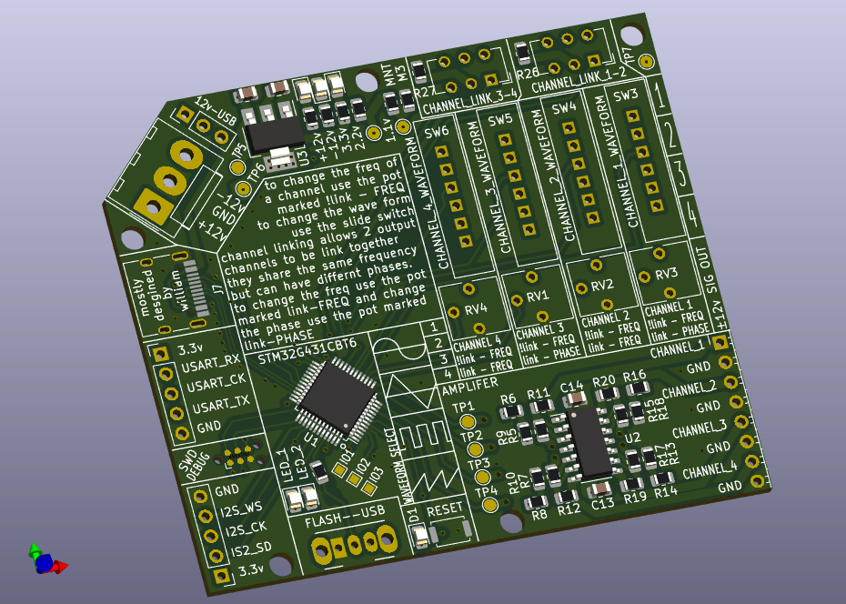

# function-generator
[WARNING] THIS BOARD HAS NOT BEEN BUILT YET AND MAY NOT WORK

Simple stm32G4 based function generator.

has USART, and I2S, with 4 DAC outputs. DACs can be controlled with switches on the board to select their waveforms frequency and phase.

